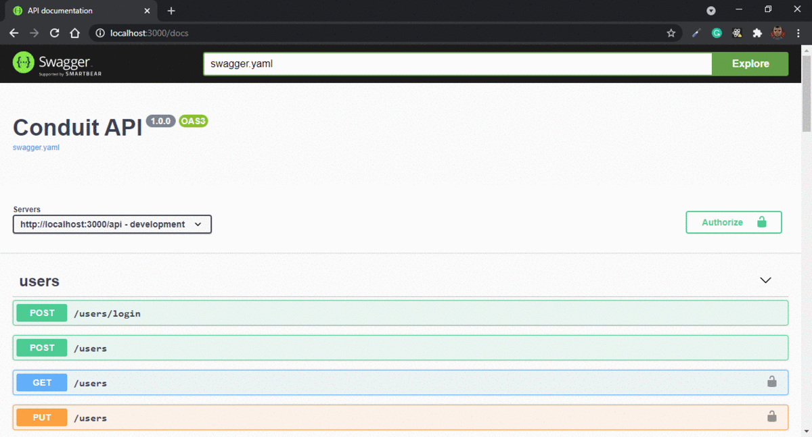

<h1 align="center">
  Mini Conduit
</h1>

<p align="center">
  <a href="#rocket-project">Project</a>&nbsp;&nbsp;&nbsp;|&nbsp;&nbsp;&nbsp;
  <a href="#computer-techs">Techs</a>&nbsp;&nbsp;&nbsp;|&nbsp;&nbsp;&nbsp;
  <a href="#thinking-how-to-use">How to use</a>&nbsp;&nbsp;&nbsp;|&nbsp;&nbsp;&nbsp;
  <a href="#memo-license">License</a>
</p>

## :rocket: Project

:newspaper: This project is an API that contains the needed resources to manage a small blog



## :computer: Techs

- go
- gorilla/mux
- go-OpenAPI
- jwt-go
- pq

## :thinking: How to use

```sh
git clone https://github.com/flaviogf/mini_conduit.git

cd godo

docker-compose up --build -d
```

## :memo: License

This project contains the MIT license. See the file [LICENSE](LICENSE).
